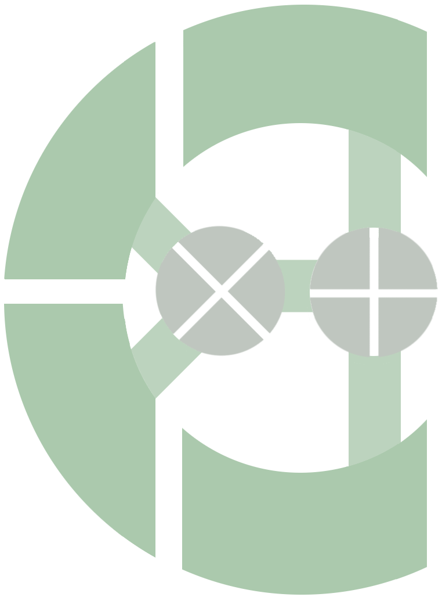

<span style="font-size: 80px; display: inline; color: #abc9ad"><b>aMPL</b><span>

## Introduction
**Ca**tegorical **M**essage **P**assing **L**anguage (CaMPL) is a typed functional-style concurrent language in which processes
communicate by passing messages on channels.
The Semantics of CaMPL is based on the categorical theory of message
passing.

## Why CaMPL?
* **Concurrent Types:** CaMPL has typed communication along channels: these concurrent types are called protocols.
* **Deadlocks and Livelocks:** Pure CaMPL is deadlock and livelock free and guaranties progress.
* **Controled Non-Determinism:** CaMPL has races which allow non-deterministic concurrent behaviour.
* **Sequential Data:** CaMPL has data and codata declarations.
## Installation

### Prerequisites:

For installing CaMPL, you need to have stack and alacritty terminal installed.

Stack is a program for developing and managing Haskell projects. You
can learn more about it [here](https://docs.haskellstack.org/en/stable/)

And Alacritty is a terminal emulator that CaMPL uses it for concurrent
interactions with users. You can learn more about Alacritty [here](https://alacritty.org/)

### installation Process

1. Download the installation script and run it by running the following command in your terminal:

```sh
mkdir ~/.campl && cd ~/.campl && curl -LJO
https://raw.githubusercontent.com/campl-ucalgary/campl/main/install
&& chmod +x install && ./install
```

2. Add campl to your `PATH` variable:

```sh
export PATH="$HOME/.campl/bin:$PATH"
```
